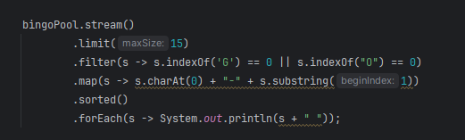

**Java Streams - What they are and what they aren't**
- When you think of a stream, you might be thinking of I/O streams, like a buffered input stream or file output. 
- That isn't the type of stream I'm talking about here. 
- Oracle's Java documentation describes a stream as **Stream** - A sequence of elements supporting sequential and parallel aggregate operations. 
- Streams are a mechanism for describing a whole series of processes, before actually executing them. 

**A Stream is different from a Collection**
- The stream and the collection types were designed for different purposes. 
- A **collection** is used to **store and manage a series of elements** in Java, providing **direct access** to the Collection elements. 
- You can use collections to manipulate or query a set of data. 
- There's nothing you can do with a stream, that you couldn't already do with a Collection. 
- However, a **stream** was designed to **manage the processing of elements.**
- Streams don't actually store elements, instead these elements are computed on demand, from a data providing source.

**The Lazy Stream**
- Another important difference is that streams are lazy, like lambda expression variables. 
- When you call many of the methods on a stream, execution may not immediately occur. 
- Instead, you'll need to invoke a special operation on the stream, like you would by calling a lambda's functional method. 
- This special operation is called a terminal operation. 

**Why Use a Stream?**
- Streams are an exciting addition to Java, because they provide several benefits.
  - First, they make the code to process data uniform, concise and repeatable, in ways that feel similar to a database's structured query language(SQL).
  - Second, when working with large collections, parallel streams will provide a performance advantage.
- All of the code samples I've provided up to this point, using collections, will continue to be valuable for many use cases. 
- It's time to talk about this new way of doing things, using this additional functional programming feature.

**BINGO**
- Each ball is identified with either a B, I, N, G, or O, and followed by a number. 
- A B ball will have a number from 1 to 15, an I ball will get a number between 16 thru 30, and so on. 
- Someone will draw a ball out of the container, and announce it.
- Every player will have a five-by-five card, with some randomly generated set of these numbers on it.
- The first column has the B numbers, the second column has the I numbers, and so on.
- You win by being the first person to match five called numbers in a row, either horizontally, vertically, or diagonally.

**The Stream Pipeline** 
- In the last video, I finished with my first example of using a stream in code.
- This entire chain of operations is what's called a Stream Pipeline.

**The Pipeline starts with a Source**
- The source of the stream is where the data elements are coming from.
- In our example, it's coming from a list, bingoPool.
- All pipelines start with a stream, so in this example, we need to call the stream method on the bingoPool List to get a stream. 
- There are a lot of other kinds of sources, and ways to create new streams, including infinite streams.

**The Pipeline starts with a Source**
- Stream Pipelines end in a **terminal operation**, which produces a result or side-effect.
- In this example, the forEach operation executes a Consumer implementation. 
- This prints out some data about each element that was processed, and its current state.
- A terminal operation is required. 

**The Intermediate Operations**
- Everything else between the source and the terminal operation is an intermediate operation.
- An intermediate operation is **not required**.
- You can have a pipeline that has just a source and terminal operation, and these are quite common. 
- Every intermediate operation processes elements on the stream, and returns a stream as a result.

**Streams are Lazy**
- Without worrying about semantics, I want you to imagine the stream pipeline as a black box. 
- The source is your input, the result of your terminal operation is your output.
- Everything in between, isn't going to happen until something tells that terminal operation to start. 
- What actually happens in that black box, may not happen exactly as you've described it, or in the order you've specidfied.
- Execution of the intermediate operations is dependent, first on a terminal operation being specified, and second on an optimization process occuring. 

**Stream Computations are optimized**
- What this means is that your stream pipeline is kind of a workflow suggestion.
- Before the process begins, the stream implementation will perform an evaluation, to optimize the means to the end.
- It will determine the best way to get the elements needed, and the most efficient way to process them, to give you the result you've asked for. 
- The result will be consistent each time, but the process to get there is not guaranteed to be.
- Optimizations may change the order of the intermediate operations, it may combine operations, or even skip them altogether. 
- For this reason, **you should avoid side effects in your intermediate operations.**

**You can't reuse a stream**
- Once you invoke a terminal operation on a stream, you can think of the pipeline as being opened, and the flow beginning.
- The flow is allowed to continue until all processes have been performed and a result produced.
- At that point, the valve is shut, and the piepleine closed. 
- You can't turn it back on, or reuse it for a new source.
- If you want to do the same sort of thing with a different variable for one of the intermediate operations, you'd need to set up a new pipeline.

**Stream Types May Change As the Pipeline Process Progresses**
- An intermediate operation can usually be recognized by its signature, because it returns a Stream.
- I want to point out, that this doesn't mean the element type of the Stream can't change.
- In practice, you'll be regularly transforming your stream element to a different type.

**The Most Common Intermediate Operaations**
- Up until now, I've kind of glossed over intermediate operaations. 
- I've used filter, limit, map and sorted in my examples. 
- As you can see from this table, the operations you've already seen briefly, cover half of the basic operations available to your stream pipelines.

  | Return Type | Operation                                                                                                                          |
  |-------------|------------------------------------------------------------------------------------------------------------------------------------|
  | `Stream<T>` | distinct()                                                                                                                         |
  | `Stream<T>` | filter(Predicate<? super T> predicate) takeWhile(Predicate<? super T> predicate) dropWhile(Predicate<? super T> predicate) |
  | `Stream<T>` | limit(long maxSize)                                                                                                                |
  | `Stream<R>` | map(Function<? super T, ? extends R> mapper)                                                                                       |
  | `Stream<T>` | peek(Consumer<? super T> action)                                                                                                   |
  | `Stream<T>` | skip(long n)                                                                                                                       |
  | `Stream<T>` | sorted() sorted(Comparator<? super T> comparator)                                                                              |
  
**Intermediate Operations that effect the size of the Resulting Stream**
- I'll staart by talking about the set of operations, that may change the number of elements in the resulting stream.

  | Return Type | Operation                                                                                                                         | Description                                                                                                                                                                                                                                                                |
  |-------------|-----------------------------------------------------------------------------------------------------------------------------------|----------------------------------------------------------------------------------------------------------------------------------------------------------------------------------------------------------------------------------------------------------------------------|
  | `Stream<T>` | distinct()                                                                                                                        | Removes duplicate values from the Stream.                                                                                                                                                                                                                                  |
  | `Stream<T>` | filter(Predicate<? super T> predicate takeWhile(Predicate<? super T> predicate) dropWhile(Predicate<? super T> predicate) | These methods allow you to reduce the elements in the output streaam. Elements that match the filter's Predicate are kept in the outgoing streaam, for the fitler and takeWhile operations. Elements will be dropped until or while the dropWhile's predicate is not true. |
  | `Stream<T>` | limit(long maxSize)                                                                                                               | This reduces your stream to the size specidfied in the argument.                                                                                                                                                                                                           |
  | `Stream<T>` | skip(long n)                                                                                                                      | This method skips elements, meaning they won't be part of the resulting stream.                                                                                                                                                                                            |

**Declarative Language of Stream Operations Resembles Query commands**
- The Java API designers designed the Stream to let you process data in a declarative way, much like a stuctured query launguage or SQL in a database. 
- This lets you say **what should happen**, and **not actually how it will happen.**
- If you've had experience querying databases, you might be familiar with the limit and distinct keywords, available in many database query languages.
- The filter operation represents your where clause, and sorted would be your order by clause, and so on.
- There are aggregate functions commonly used in queries as well, such as max, min, count and so on. 