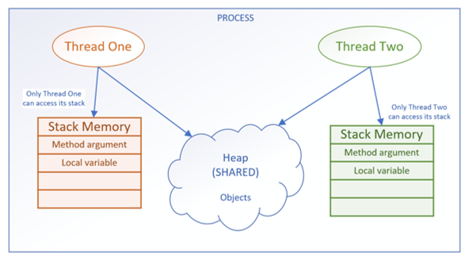
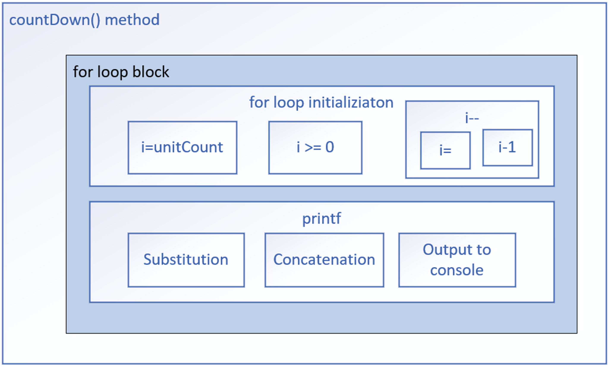

**Introduction to Concurrency and Threads**
- Process is a unit of execution, that has its own memory space.
- The terms process and application are foten used interchangeably, and I've done that myself, and will again in this section.

**Process memory space = Heap**
- Each application has its own memory space, also known as the heap.
- The heap isn't shared between two applications or two processes, they each have their own.

**A Thread**
- A thread is a single unit of execution, within a process.
- Each process can have multiple threads. 
- Every application has at least one thread, and that's the main thread. 
- Our code will run on the main thread. 
- We can also have our code run in other threads, which we can explicitly create and start. 

**Threads Share Process Memory**
- Creating a thread doesn't require as many resources as creating a process does.
- Every thread created by a process, shares that process's memory space, the heap.
- This can cause big problems with your applications.

**Threads also have Stack Memory**
- Each thread's got what's called a thread stack.
- This is memory, that only a single thread, will have access to. 
- Every Java application runs as a single process, and each process can then have multiple threads within it.
- Every process has a heap, and every thread has a thread stack. 

**Why use multiple threads?**
- What are some of the adavantages, to creating a multi-threaded application?
- One of the most common reasons, is to offload long running tasks. 
- Instead of tying up the main thread, we can create additional threads, to execute tasks that might take a long time. 
- This frees up the main thread so that it can continue working, and executing, and being responsive to the user. 
- You also might use multiple threads to process large amounts of data, which can improve performance, of data internsive operations.
- A web server, is another use case for many threads, allowing multiple connections and requests to be handled, simultaneously. 

**Concurrency**
- Concurrency, refers to an application doing more than one thing at a time. 
- Concurrency allows different parts of a program to make progress independently, often leadig to better resource utilization and improved performance. 
- One task doesn't have to complete, before another one can start, and multiple threads can make incremental progress.

**Java's Threads**
- Threads are the fundamental building blocks, to support concurrency, in a Java application. 
- They're essential, because they allow us to perform multiple tasks simultaneously, within a single process. 

**The java.util.Thread Class** 
- this class implements the Runnable interface, which has a single abstract method, the run method. 
- Each instance of a thread has some state. 
- The fields displayed here are all encapsulated and this includes thread group, a name, a priority, a staus, and a thread id. 
- A thread can be constructed with no arguments. 
- It can be constructed by passing a Runnable instance to it. 
- The first method is the run method, which has to be overridden, sinct it's declared abstract on the Runnable interface. 

**Thread Priority**
- Thread priority is a value from 1 to 10.
- The Thread class has three pre-defined priorities, included as constants. 
- Thread.MIN_PRIORITY = 1 (low)
- Thread.NORM_PRIORITY = 5 (default)
- Thread.MAX_PRIORITY = 10 (high)
- Higher-priority threads have a better chance of being scheduled, by a thread scheduler, over the lower-priority threads. 
- However, priority behavior can vary across different operating systems and JVM implementations. 
- You can think of this priority as more of a suggestion, to the thread management process. 

**Creating a Thread Instance**
- Extend the Thread class, and create an instance of this new subclass. 
- Create a new instance of Thread, and pass it any instance that implements the Runnable interface. This includes passing a lambda expression. 
- Use an Executor, to create one or more threads for you. 

**The difference between executing run and start on a thread**
- There's a big difference between calling run() and start().
- If you execute the run method, it's executed synchronously, by the running thread it's invoked from. 
- If you want your code to be run asynchronously, you must call the start method. 

The native modifier on a method 
- The native modifier indicates that this method's source code isn't written in Java. 
- It's written in another language, such as C or C++. 
- The code in this example, is part of a native library, such as a dll file. 

Why use a native library? 
The reasons to do this include 
- To access system-level functionality that's platform-specific. 
- To interface with hardware. 
- To optimize performance for tasks that might be computationally-intensive. 

Runnable is a Functional Interface 
- It's important to recognize that Runnable is a functional interface. 
- It's functional method, or its single access method, is the run method. 
- Anywhere you see a Runnable type, it's a target for a lambda expression. 
- You can have any class implement the Runnable interface to run asynchronously. 

Extending the Thread Class
- The new subclass overrides the Thread's run method, to provide the concurrent thread's task. 
- To use this thread, you create a new instance of your subclass, with a no argument constructor, and execute the start method on that instance. 

Advantages of Extending Thread
- You have more control over the thread's behavior and properties. 
- You can access the thread's methods and fields directly from your sub class. 
- You can create a new thread for each task.

Disadvantages of Extending Thread
- You can only extend one class in Java, so your subclass can't extend any other classes. 
- Your class is tightly coupled to the Thread class, which may make it difficult to maintain. 

Implementing Runnable
- Besides extending the Thread class, you can create threads, by implementing the Runnable interface. 
- This method allows any class, to implement Runnable, meaning any class at all, can be used in a thread. 
- This class is passed to the Thread constructor, that accepts a Runnable. 
- You can also pass an anonymous class, lambda expression, or a method reference to this constructor, to create an instance of a Thread. 

- You again call start on the new thread instance, to execute the code asynchronously. 

Advantages of Implementing a Runnable and creating a Thread instance with it. 
- You can extend any class and still implement Runnable. 
- Your class(if you create a class) is loosely coupled to the Thread class, which makes it easier to maintain. 
- You can use anonymous classes, lambda expressions, or method references, to very quickly describe thread behavior. 

Disadvantages of Implementing a Runnable and creating a Thread instance with it
- You do have less control over the thread's behavior and properties. 
- In other words, You can't access the thread's methods and fields directly, from the run method.

**Threads accessing memory**
- Each thread has its own stack for local variables and method calls.

- One thread doesn't have acess to another thread's stack.
- Every concurrent thread additionally has access to the process memory, or the heap.
- Every concurrent thread additionally has access to the process memory, or the heap.
- This is where objects and their data reside.
- This shared memory space allows all threads, to read and modify the same objects.
- When one thread changes an object on the heap, these changes are visible to other threads.

**Time Slicing**
- Time slicing is also known as time-sharing or time division.
- It's a technique used in multitasking operating systems, to allow multiple threads or processes to share a single CPU for execution.
- Available CPU time is sliced into small time intervals, which are divided out to the threads.
- Each thread gets that interval, to attempt to make some progress, on the tasks it has to do.
- Whether it completes its task or not, in that time slice, doesn't matter to the thread management system.
- When the time is up, it has to yield to another thread, and wait until its turn again.
- Unfortunately, when your threads are sharing heap memory, things can change during that wait.

**The Java Memory Model(JMM)**
- The Java Memory Model, is a specification that defines some rules and behaviors for threads, to help control and manage shared access to data, and operations.
- **Atomicity of Operations.** Few operations are truly atomic.
- **Synchronization** is the process of controlling threads' access to shared resources.

**Interference**

- On this slide, I'm showing you a conceptual picture of the countDown method.
- Each box shown in this diagram is a unit of work
- Only the smallest blocks might be atomic.
- A Thread can be halfway through the work in any one of these blocks, when it's time slice expires, and it then has to pause or suspend execution, to allow other threads to wake up and execute.
- This means another active thread has an open door, to that same unit of work, where the paused thread is partialloy done.
- When threads start and pause, in the same blocks as other threads, this is called interleaving.

**Interleaving**
- When multiple threads run concurrently, their instructions can overlap or interleave in time.
- The execution of multiple threads happens in an arbitary order.
- The order in which the threads execute can't be guaranteed.

**Atomic Actions**
- In programming, an atomic action is one, that effectively happens all at once.
- An atomic action either happens completely, or it doesn't happen at all.
- Side effects of an atomic action are never visible until the action completes.

**Even the simplest operations may not be atomic**
- Even decrements and increments, aren't atomic, nor are all primitive assignments. 
- For example, long and double assignments may not be atomic in all JVMs.
- This slide shows three examples of operations that may not be atomic.

| Increment Operand | Decrement Operand | Assignment of a long value |
|-------------------|-------------------|----------------------------|
| i++               | --i               | i = 100_000_000_000L       |

Even simple statements can translate to multiple non-atomic steps by the virtual machine.

**Thread-Safe**
- An object or a block of code is thread safe, if it isn't compromised, by the execution of concurrent threads.
- This means, the correctness and consistency of the program's output or its visible state, is unaffected by other threads.
- Atomic operations and immutable objects are examples of thread-safe code.

**Memory Consistency Errors**
- The operating system may read from heap variables, and **make a copy** of the value, in each thread's own storage cache.
- Each thread has its own small and fast memory storage, that holds its own copy of a shared resource's value.
- One thread can modify a shared variable, but this **change might not be immediately reflected or visible.**
- Instead, it's first updated in the thread's local cache.
- The operating system may not flush the first thread's changes to the heap, until the thread has finished executing.

**Volatile**
- The volatile keyword is used as a modifier for class variables.
- It's an indicator that this variable's value may be changed by multiple threads. 
- This modifier ensures that the variable is always read from, and written to the main memory, rather than from any thread-specific caches.
- This provides memory consistency for this variable's value across threads.
- Volatile has limited usage though.

**When to use volatile**

There are specific scenarios when you'll want to use volatile.
- When a variable is used to track the state of a shared resource, such as a counter or a flag.
- When a variable is used to communicate between threads.

**When NOT to use volatile**
- When a variable is only used by a single thread.
- When a variable is used to store a large amount of data.

**Producer Consumer Application**
- This kind of application has a class that produces data, so the Producer. 
- It also has a class that reads the data, or consumes it in some way, this is the Consumer.

**Deadlock**
- Thread A is our Consumer. 
- It can usually get in, to run the read method, because the hasMessage flag is usually true.
- If the flag is false, it will execute it's while loop.
- It's waiting on that hasMessage flag to change value, to exit the loop.
- That flag is never going to change its value.
- Thread A has acquired a lock on the shared resourse, in this case the Message Repository, and Thread B can't get that lock. 
- Because Thread B is blocked, it can't change the flag, that would set the condition to let Thread A exit it's while loop, and release the lock.
- The threads are stuck, one spinning indefinitely, the other blocked from doing anything. 
- This is a classic deadlock situation. 

**The Object class's wait, notify and notifyAll methods**
- The wait, notify, and notifyAll methods, are used to manage some monitor lock situations, to prevent threads from blocking indefinitely.
- Because these methods are on Object, any instance of any class, can execute these methods, from within a synchronized method or statement. 

**The Purpose of a Lock**
- The purpose of a lock is to control access to a shared resource by multiple threads. 

**Limitations of the Monitor Lock**
- The monitor lock is pretty easy to use, but it does have limitations. 
    1. There's no way to test if the intrinsic lock has already been acquired. 
  2. There's no way to interrupt a blocked thread.
  3. There's not an easy way to debug, or examine the intrinsic lock. 
  4. The intrinsic lock is an exclusive lock. 

**java.util.concurrent.locks package**
- JDK5 gave us the java.util.concurrent package.
- This provided developers with some additional solutions, to prevent problems in a multi-threaded environment. 
- The Lock Interface, and some of the provided implementations, can give us a bit more control, and flexibility over locking, and when and how to block threads. 

**Lock Hold Count**
- The hold count of a lock counts the number of times that a single thread, the owner of the lock, has acquired the lock.
  - When a thread acquires a lock for the first time, the lock's hold count is set to one. 
  - If a lock is re-entrant, and a thread, reacquires the same lock, the lock's hold count will get incremented. 
  - When a thread releases a lock, the lock's hold count is decremented. 
  - A lock is only released when it's hold count becomes zero.
  - Because of this, it's really important to include a call to the unlock method in a finally clause, of any code that will acquire a lock, even if it's re-entrant.
  
**Review of the Advantages of using Lock implementations**
- **Explicit Control** over when to acquire and release locks, making it easier to avoid deadlocks, and manage other concurrency challenges. 
- **Timeouts** allow you to attempt to acquire a lock without blocking indefinitely.
- Along with timeouts, **Interruptible Locking** lets you handle interruptions during acquisition more gracefully.
- **Improved Debugging** methods let you query the number of waiting threads, and check if a thread holds a lock.

**Managing Threads**
- These are the ExecutorService classes, and they exist to manage the creation and execution of threads. 

**Managing Individual Threads**
- When using a Thread class, you have rudimentary control over that thread. 
- You can interrupt a thread, and join it to another thread. 
- You can name the thread, try to prioritize it, and start each manually, one at a time. 
- You can also pass it an UncaughtExceptionHandler, to deal with exceptions that happen in a thread. 
- Managing threads manually can be complex and error-prone. 
- It can lead to complex issues like resource contention, thread creation overhead and scalability challenges. 
- For these reasons, you'll want to use an ExecutorService, even when working with a single thread. 

**Benefits of Managing Threads with an Implementation of ExecutorService**
- The ExecutorService type in Java is an interface. Java provides several implemnetations of this type which provide the following benefits:
  - Simplify thread management, by abstracting execution, to the level of tasks which need to be run. 
  - Use Thread Pools, reducing the cost of creating new threads. 
  - Efficient Scaling, by utilizing multiple processor cores. 
  - Built-in synchronization, reducing concurrency-related errors.
  - Graceful Shutdown, preventing resource leaks. 
  - Scheduled implementations exist to further help with management workflows. 
  
**Advantages of using an ExecutorService**
- The job of managing threads is simplified. 
- ExecutorService implementations let you stay focused on tasks that need to be run, rather than thread cration and management. 

**Creating Threads is Expensive**
- Creating threads, destroying threads, and then creating them again can be expensive. 
- A thread pool mitigates the cost, by keeping a set of threads around, in a pool, for current and future work.
- Threads, once they complete one task, can then be reassigned to another task, without the expense of destroying that thread and creating a new one. 

**The Mechanics of a Thread Pool** 
- A thread pool consists of three componenets. 
  - **Worker Threads** are available in a pool to execute tasks. They're pre-created and kept alive, throughout the lifetime of the application. 
  - **Submitted Tasks** are placed in a First-In First-Out queue. Threads pop tasks from the queue, and execute them, so they're executed in the order they're submitted. 
  - **The Thread Pool Manager** allocates tasks to threads, and ensures proper thread synchronization.
  
